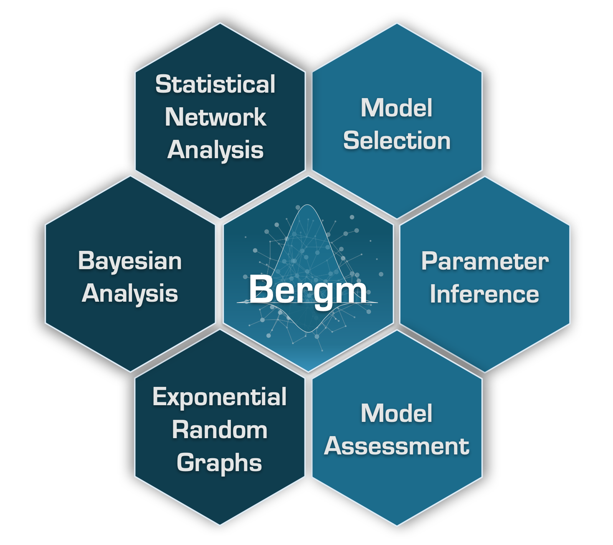

<link rel="stylesheet" href="styles.css" type="text/css">

<!-- Global site tag (gtag.js) - Google Analytics -->

## The Bergm package - Bayesian exponential random graph models

**CRAN**: <https://CRAN.R-project.org/package=Bergm>

The Bergm package for R provides a comprehensive framework for Bayesian parameter estimation and model selection for exponential random graph models using various algorithms. It can also supply graphical Bayesian goodness-of-fit procedures that address the issue of model adequacy. See also Alberto Caimo's [webpage](https://acaimo.github.io).
