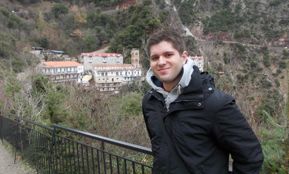

```{r, echo=F}
title_var <- "Lampros Bouranis - Home"
```    
---
title: `r title_var`
---

<link rel="stylesheet" href="styles.css" type="text/css">



<style>
.title {display: none}
  
.body {text-align: justify}
</style>

Welcome to my personal website! 

I am currently a Marie Sklodowska-Curie Research Fellow at the [Department of Statistics](https://www.dept.aueb.gr/en/stat), Athens University of Economics and Business. My research focuses on Bayesian inference and model selection for stochastic epidemics under the supervision of [Prof. Nikos Demiris](http://www2.aueb.gr/users/nikos/) and [Prof. Ioannis Ntzoufras](https://www.aueb.gr/en/faculty_page/ntzoufras-ioannis/).

I obtained my PhD in Statistics at [University College Dublin](http://www.ucd.ie/) under the supervision of [Prof. Nial Friel](https://maths.ucd.ie/~nial/) and the mentoring of [Dr. Florian Maire](https://maths.ucd.ie/~fmaire/). My research project was funded by the [Insight Centre for Data Analytics](http://www.insight-centre.org/) and the main focus lied on the Bayesian analysis of intractable likelihoods with applications to Gibbs random fields.

My full CV is available [here](Bouranis_CV.pdf) [last update: 16/6/2023].

### News and upcoming events

#### 2023

##### July 

* I will be presenting my work on _Bayesian learning of transmission dynamics using exchangeable Gaussian processes_ at the Greek Stochastics $\nu$' Meeting at Naxos, Greece [7-10 July].

##### June

* **New preprint!** -- **Bouranis, L.** (2023). Bernadette: Bayesian Inference and Model Selection for Stochastic Epidemics in R \
[JOSS preprint](https://github.com/openjournals/joss-reviews/issues/5541)

* **Software announcement** The Bernadette (“Bayesian inference and model selection for stochastic epidemics”) R package v1.1.4 is now available on the Comprehensive R Archive Network (CRAN), see the package [webpage](https://CRAN.R-project.org/package=Bernadette). Bernadette provides a framework for Bayesian analysis of infectious disease transmission dynamics via diffusion driven multi-type epidemic models with time-varying epidemiological parameters, with a particular focus on Coronavirus Disease 2019 (COVID-19). It uses the Stan probabilistic programming language and implements the Bayesian epidemic model described in [Bouranis et al](https://arxiv.org/abs/2211.15229). For models fit using Markov chain Monte Carlo, it allows for computation of approximate leave-one-out cross-validation (LOO, LOOIC) or the Widely Applicable Information Criterion (WAIC) for model checking and comparison.

* I presented my work at the MRC Biostatistics Unit, University of Cambridge seminar. The talk is available at the MRC BSU [YouTube channel](https://www.youtube.com/@MRC_BSU/videos).

* I presented my work at the HERMES Ph.D. Workshop 2023: “Data Science in Business”, which took place in Athens, Greece, at the premises of the Department of Statistics, AUEB.

##### May

* **Workshop!** -- [Nikolaos Demiris](http://www2.aueb.gr/users/nikos/) and myself organized the workshop _Statistical modeling of epidemic outbreaks_ with a fantastic series of talks. A big thank you to our guests who honoured us with their presence! For more information you can visit the [workshop webpage](https://bernadette-eu.github.io/workshop).

* Together with Prof Ioannis Ntzoufras we visited the 1st Senior High School of Markopoulo, participating in the Action "Visits of faculty members to secondary education schools" of the program "Outreach and information program for the school community", where we presented and discussed the merits of studying at the Department of Statistics at AUEB and career opportunities.

##### February

I participated in the Action "Visits of faculty members to secondary education schools" of the program "Outreach and information program for the school community", organised by the Department of Statistics, Athens University of Economics and Business (AUEB). Students of the senior high school "Nea Pedia" visited the Computational and Bayesian Statistics Laboratory (Troias Building) at the premises of AUEB. Together with Prof Ioannis Ntzoufras, and PhD candidate Ilias Leriou we discussed our experiences as statisticians, the benefits of studying Science. I also presented how the Marie Curie action’s work relates to our everyday lives.

#### 2022

##### November

* **New preprint!** -- **Bouranis, L.**, Demiris, N., Kalogeropoulos, K. and Ntzoufras, I. (2022). 
\
**Bayesian analysis of diffusion-driven multi-type epidemic models with application to COVID-19**. \
[arXiv](https://arxiv.org/abs/2211.15229)

##### October

This summer I presented my work on "Bayesian analysis of diffusion driven multi-type
epidemic models with application to COVID-19" (joint with Nikos Demiris, Konstantinos Kalogeropoulos and Ioannis Ntzoufras) at the following conferences/meetings:

* Royal Statistical Society International Conference, Aberdeen, UK (September 2022).
* Greek Stochastics $\mu$' Meeting at Corfu, Greece (August 2022).
* AUEB-NKUA-Indiana Conference in Biostatistics & Health Analytics, Aegina, Greece (July 2022).
* 3rd research meeting of the School of Information Sciences and Technology, Athens University of Economics and Business, Greece (June 2022).

##### September

* **New publication!** -- Caimo, A. , **Bouranis, L.**, Krause, R. and Friel, N. (2022). \
Statistical Network Analysis with Bergm. \
*Journal of Statistical Software*, 104(1):1-23. DOI: 10.18637/jss.v104.i01
[Link](https://www.jstatsoft.org/article/view/v104i01) |
[arXiv](https://arxiv.org/abs/2104.02444)

#### 2021

##### October

* **Talk** - The abstract and pdf of the presentation is available [here](https://www.dept.aueb.gr/en/stat/events/seminar-statistical-network-analysis-bergm). The presentation is also available on the [AUEB-Stats YouTube channel](https://www.youtube.com/c/AUEBStats).

##### July

* Version 5.0.3 of the Bergm R library is available on [CRAN](https://cran.r-project.org/web/packages/Bergm/index.html). 

##### May

* The [website](https://bernadette-eu.github.io/) for the BERNADETTE Marie Sklodowska-Curie Action (MSCA) is live. Feel free to bookmark this to keep an eye on the project updates. The website is accompanied by a Twitter profile: [BernadetteMsca](https://twitter.com/BernadetteMsca).

##### April

* I will be joining the Department of Statistics at Athens University of Economics and Business as a **Marie Sklodowska-Curie Fellow**. Looking forward to it!

* **New preprint!** -- Caimo, A., **Bouranis, L.**, Krause, R. and Friel, N. (2021).
Statistical Network Analysis with Bergm.
*Journal of Statistical Software*, Accepted.
[arXiv](https://arxiv.org/abs/2104.02444)